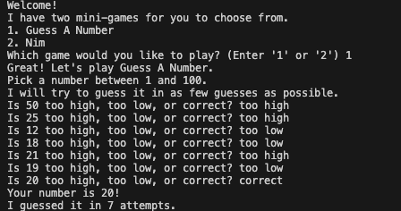
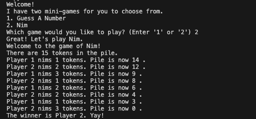

# Mini Games Python Project

## About
I built a small Python program with two fun mini games:

1. **Guess A Number** – The computer picks a random number, and you try to guess it.  
2. **Nim** – A simple strategy game where players take turns removing objects from a pile.  

This project was a chance to practice Python basics like loops, conditionals, functions, and handling user input, while making something interactive and fun.

---

## Features
- Simple terminal-based games that are easy to play.  
- A menu system to pick which game to play.  
- Modular code that can be expanded with more games or features.  

---

## Screenshots

**Guess A Number**  
  

**Nim**  
  

---

## Requirements
- Python 3.x  
- Terminal or command line  

---

## Notes
This project was mainly about learning and experimenting with Python.  
I designed it so I (or anyone) could easily add more games or tweak the code to try new ideas.
